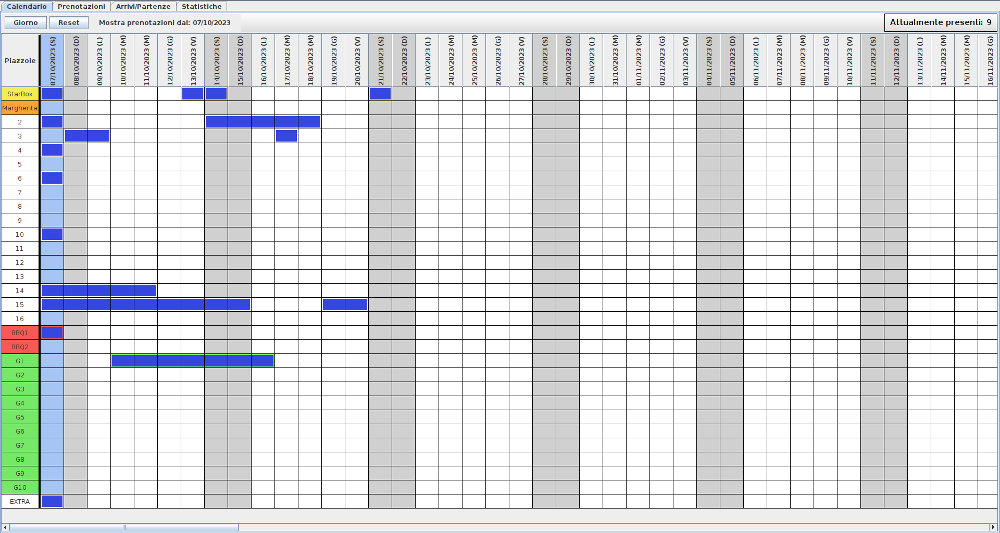
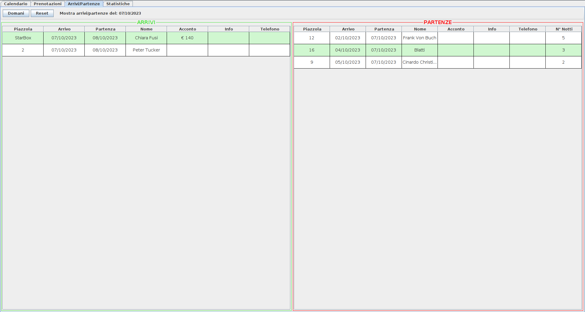

# Agricamping Spineta - Gestione Prenotazioni

Il progetto consiste nella realizzazione di un'applicazione desktop per la gestione del sistema di prenotazioni presso Agricamping Spineta. L'obiettivo principale è offrire uno strumento efficiente per organizzare le prenotazioni, gli arrivi e le partenze. Questo è reso possibile attraverso una rappresentazione visuale di un calendario che semplifica la visualizzazione e la gestione delle prenotazioni confermate.

Di seguito sono elencate le principali caratteristiche dell'applicazione:

## Caratteristiche Principali

1. **Gestione Prenotazioni:** Registra nuove prenotazioni, con dettagli come date di arrivo e partenza, piazzola assegnata, eventuale acconto ed informazioni sul tipo di clientela.

2. **Calendario:** Utilizza un calendario a griglia interattivo per visualizzare le prenotazioni in corso e quelle future.

3. **Arrivi/Partenze:** Visualizza in tempo reale gli arrivi e le partenze del giorno odierno, con la possibilità di visualizzare quest'ultimi anche per il giorno successivo

3. **Statistiche:** Accedi alle statistiche per analizzare i dati sulle presenze, i mezzi e le nazioni della clientela per ogni anno dell'attività. 

4. **Backup Automatici:** L'applicazione esegue automaticamente il backup dei dati sull'account Google Drive registrato, garantendo la sicurezza delle informazioni ed il loro eventuale ripristino in caso di danneggiamento tramite l'opzione Importa.

## Immagini

- **Lista delle prenotazioni salvate:**

- **Calendario delle prenotazioni:**

- **Visualizzazione arrivi e partenze:**

- **Visualizzazione delle statistiche:**

## Requisiti di Sistema

- **Sistema Operativo:** L'applicazione è compatibile con Windows, macOS e Linux.
- **Java Runtime Environment (JRE):** È necessario disporre di Java JRE 8 o versione successiva

